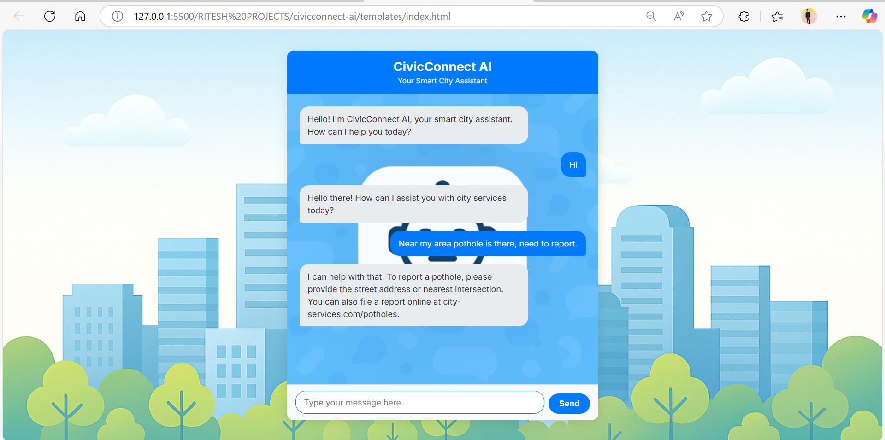

**## 🤖 CivicConnect AI**

A friendly and intelligent chatbot designed to serve as a "smart city assistant." This project provides a clean, modern interface for citizens to report common civic issues and get instant information about city services.

---

## ✨ Features

- **Interactive Chat UI:** A responsive and intuitive chat window built with HTML, CSS, and JavaScript.
- **Intelligent Bot Responses:** The bot can understand and respond to keywords related to common issues like:
  -  potholes 🛣️
  - garbage & recycling 🗑️
  - water leaks 💧
  - streetlight outages 💡
  - parking & taxes 🅿️
- **Custom Backgrounds:** Features separate, customizable background images for the main page and the chat message area.
- **Typing Indicator:** A sleek animation shows when the bot is "thinking," improving user experience.
- **Auto-Resizing Text Area:** The message input box grows and shrinks dynamically with the content.
- **Pure Frontend:** Runs entirely in the browser with no backend dependencies, making it lightweight and easy to deploy.
- **Future-Ready Backend (Optional):** Includes a basic `app.py` using Flask, setting the stage for future integration with a real AI/ML model.

---

## 🎯 Final Output (Frontend Only)
Once you open index.html in your browser, you’ll see:

🌆 A beautiful cityscape background setting the tone for a smart city experience.
💬 A sleek, responsive chatbot panel with a welcome message from CivicConnect AI.
🤖 Real-time bot responses to civic issues like potholes, garbage, water leaks, and more.
✍️ A dynamic input box that adjusts as you type.
💡 A typing indicator that makes the bot feel alive and responsive.

---

## 🌐 Live Demo

[- 🔗 Click here to view the live site on Netlify](https://civicconnectbot.netlify.app/)

---

## 🛠️ Tech Stack

- **HTML5:** For the core structure of the application.
- **CSS3:** For all styling, including layouts, custom backgrounds, and animations.
- **Vanilla JavaScript (ES6+):** For all client-side logic, including message handling, DOM manipulation, and bot responses.
- **Python & Flask (Optional):** For the optional backend server.

---

## 🚀 Getting Started

### Option 1: Frontend Only (No Installation)

No complex setup is required! To run the chatbot:

1.  Ensure you have the project files on your local machine.
2.  Navigate to the `templates/` directory.
3.  Open `index.html` in any modern web browser.

### Option 2: With Backend Server (For Future Development)

1.  Ensure you have Python and pip installed.
2.  Install Flask: `pip install Flask`
3.  Run the server from the project's root directory: `python app.py`
4.  Open your web browser and go to `http://127.0.0.1:5000`.

---

## 📂 File Structure

civicconnect-ai/
│
├── data/                          # Stores structured data used by the bot
│   └── grievances.json            # Sample dataset for user grievances or queries
│
├── static/                        # Contains all static frontend assets
│   ├── css/                       # Stylesheets for the chatbot UI
│   │   └── style.css              # Main stylesheet with layout and design
│   ├── images/                    # Backgrounds and visual assets
│   │   ├── botbackground.png      # Optional background for message area
│   │   └── mainbackground.png     # Cityscape background for full-page layout
│   └── js/                        # JavaScript files for interactivity
│       └── chat.js                # Handles message sending and bot responses
│
├── templates/                     # HTML templates for rendering the UI
│   └── index.html                 # Main chatbot interface page
│
├── app.py                         # Backend logic placeholder (Flask/FastAPI ready)
└── README.md                      # Project overview and setup instructions

---

## 👤 Author

**Ritesh Raut**  
*Programmer Analyst, Cognizant*

CivicConnect AI — Your Smart City Assistant, bridging citizens and services with a smile! 🏙️🤖💬

---

### 🌐 Connect with me:

---